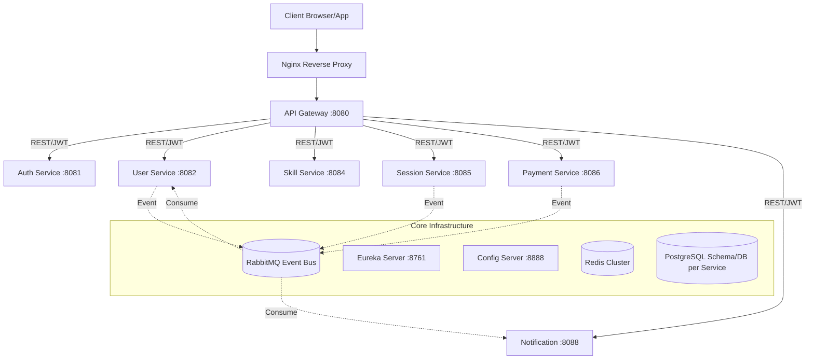

# 🚀 SkillSync — Microservices E-Learning Platform

SkillSync is a production-grade, distributed microservices platform designed to seamlessly connect learners with tech mentors. It features robust distributed transactions, real-time eventual consistency, and highly-available cache layers resilient to partition failures.

## 🏗️ System Architecture

SkillSync utilizes an API Gateway for routing and authentication, and delegates business domains to 6 distinct Spring Boot microservices via an Event-Driven architecture powered by RabbitMQ. 



## 🛠️ Tech Stack

### Backend
- **Java 17 & Spring Boot 3.3.4**
- **Spring Cloud:** Eureka (Discovery), Gateway, Config Server, OpenFeign
- **Data:** PostgreSQL (Schema per service), Spring Data JPA
- **Caching:** Redis (Cache-Aside Pattern)
- **Messaging:** RabbitMQ (Topic Exchanges, Dead Letter Queues)
- **Resilience:** Resilience4j (Circuit Breakers)

### Frontend
- **React 18 & TypeScript**
- **Networking:** Axios with central JWT interceptors
- **State:** Redux Toolkit (Auth state), React Query (Server cache state)
- **Styling:** Tailwind CSS

### Infrastructure & DevOps
- **Deployment:** AWS EC2, Nginx Reverse Proxy
- **Containerization:** Docker & Docker Compose
- **CI/CD:** GitHub Actions (Automated build, test, multi-stage deployments)

## 💡 Key Architectural Patterns

### 1. CQRS (Command Query Responsibility Segregation)
- Mutations bypass cache entirely, executing via `CommandService` on primary DBs and triggering async Cache invalidation events.
- Queries rely solely on the `QueryService` utilizing a fault-tolerant Redis layer. If Redis drops, queries natively fallback to DB without throwing 500 exceptions.

### 2. Saga Orchestration & Transactional Outbox
- **Payment Service** coordinates cross-service data changes utilizing an **Event-Driven Saga**.
- It uses the **Transactional Outbox Pattern** with `FOR UPDATE SKIP LOCKED` and Publisher Confirms to ensure atomic database writes and guaranteed message deliveries, avoiding dual-write inconsistencies.
- Automated Dead Letter Queue (DLQ) consumers and recovery schedulers rollback/compensate stuck state transitions.

### 3. API Gateway Token Offloading
- Security absolute-trust mechanism: Sub-services do not parse JWTs. 
- API Gateway strictly validates tokens securely and proxies authenticated requests by extracting and appending headers (`X-User-Id`, `X-User-Role`). Services completely discard and reject externally simulated header payloads.

## 📖 UI Documentation

Comprehensive presentation-grade HTML visual documentation can be found in the `/UI DOCS/` folder. Standardize project walk-thoughts by exploring the following views:
- [`BE-ARCHITECTURE.html`](file:///f:/SkillSync/UI%20DOCS/BE-ARCHITECTURE.html) — Backend Topology and System Decisions
- [`API_CONTRACT.html`](file:///f:/SkillSync/UI%20DOCS/API_CONTRACT.html) — Gateway Context Rules and Request Schemas
- [`PAYMENT_SAGA.html`](file:///f:/SkillSync/UI%20DOCS/PAYMENT_SAGA.html) — State Transitions & Outbox Isolation
- [`DEPLOYMENT.html`](file:///f:/SkillSync/UI%20DOCS/DEPLOYMENT.html) — Ingress flow, AWS Compute and Container automations
- [`FE-ARCHITECTURE.html`](file:///f:/SkillSync/UI%20DOCS/FE-ARCHITECTURE.html) — Component hierarchy and Data synchronization loops

> For extensive backend API testing patterns via curl/Postman along with DB initializations, view [`docs/backend_testing_guide.md`](docs/backend_testing_guide.md).

## 🚀 Getting Started

### 1. Configuration Check
Ensure Docker is securely installed. Setup standard secure keys within `.env` configuration files to hook the Razorpay SDK parameters (`RAZORPAY_API_KEY`) ensuring all test profiles synchronize flawlessly.

### 2. Startup Infrastructure & Services
Initialize all distinct databases, attached schemas, stateful RabbitMQ/Redis, and internal backend instances concurrently:
```bash
cd f:\SkillSync
docker-compose up --build -d
```

### 3. Validation Hub
Verify overall system readiness via the Eureka Server Discovery Dashboard (`http://localhost:8761`). All distinct systems (Auth, Gateway, Config, Session, Notification, User, Payment, Skill) should successfully assert an `UP` status.
