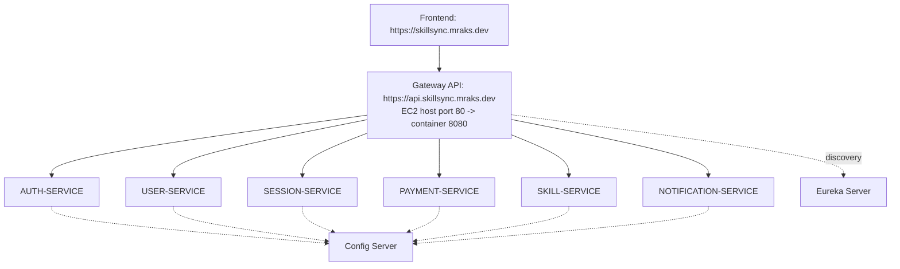

# Architecture Simplification: Removal of NGINX and Direct Gateway Routing

Date: 2026-04-01

## 1. Executive Summary

SkillSync production ingress has been simplified from:

Client -> NGINX -> API Gateway -> Microservices

to:

Client (skillsync.mraks.dev) -> API Gateway (api.skillsync.mraks.dev, port 80 -> container 8080) -> Microservices

This change removes an extra hop, reduces DNS/upstream mismatch risk, and makes troubleshooting simpler while preserving service discovery, routing, CORS, Swagger, and OAuth behavior.

## 2. Root Cause of Previous Instability

The prior model had two ingress layers (Vercel path rewrites and NGINX reverse proxy) in front of the gateway. That introduced multiple failure modes:

- Domain/API path mismatch between Vercel and EC2 ingress.
- Intermittent upstream routing failures after container restarts due to extra proxy dependency.
- Operational drift between docs, compose config, and runtime path contracts.

Simplifying to direct gateway ingress removes that class of failures.

## 3. Target Architecture



## 4. Config Changes Applied

### 4.1 Docker Compose

File: `Backend/docker-compose.yml`

Changes:

- Removed `nginx` service completely.
- Exposed gateway as single ingress:
  - `80:8080` (public)
  - `8080:8080` (debug/local checks)
- Updated header comments to reflect direct gateway architecture.

### 4.2 Service Discovery and Config Defaults

Files:

- `Backend/api-gateway/src/main/resources/application.properties`
- `Backend/auth-service/src/main/resources/application.properties`
- `Backend/user-service/src/main/resources/application.properties`
- `Backend/skill-service/src/main/resources/application.properties`
- `Backend/session-service/src/main/resources/application.properties`
- `Backend/notification-service/src/main/resources/application.properties`
- `Backend/payment-service/src/main/resources/application.properties`
- `Backend/config-server/src/main/resources/application.properties`

Changes:

- `spring.config.import` defaults to `http://${CONFIG_SERVER_HOST:skillsync-config}:8888`.
- `eureka.client.service-url.defaultZone` defaults to `http://${EUREKA_HOST:skillsync-eureka}:8761/eureka`.

Why:

- Prevents silent fallback to `localhost` inside containers.
- Reduces partial registration scenarios where some services run but are not discoverable.

### 4.3 Gateway CORS

Files:

- `Backend/api-gateway/src/main/resources/application.properties`
- `Backend/api-gateway/src/main/java/com/skillsync/apigateway/config/CorsConfig.java`

Changes:

- Default allowed origin set to `https://skillsync.mraks.dev`.
- Credentials enabled.
- Allowed methods include GET, POST, PUT, DELETE, OPTIONS, PATCH.
- Allowed headers include all headers (`*`).
- Removed implicit localhost wildcard origin patterns from code defaults.

Why:

- CORS policy is now gateway-owned and production-first.

### 4.4 Swagger/OpenAPI Public Server URL

Files:

- `Backend/auth-service/src/main/java/com/skillsync/auth/config/OpenApiConfig.java`
- `Backend/user-service/src/main/java/com/skillsync/user/config/OpenApiConfig.java`
- `Backend/skill-service/src/main/java/com/skillsync/skill/config/OpenApiConfig.java`
- `Backend/session-service/src/main/java/com/skillsync/session/config/OpenApiConfig.java`
- `Backend/notification-service/src/main/java/com/skillsync/notification/config/OpenApiConfig.java`
- `Backend/payment-service/src/main/java/com/skillsync/payment/config/OpenApiConfig.java`

Changes:

- OpenAPI `servers` now use `${APP_PUBLIC_BASE_URL:https://api.skillsync.mraks.dev}`.

Why:

- Swagger "Try it out" always targets public production ingress, not container/private URLs.

### 4.5 Frontend API/Domain Alignment

Files:

- `Frontend/src/services/axios.ts`
- `Frontend/src/pages/LandingPage.tsx`
- `Frontend/vercel.json`

Changes:

- Axios default base URL set to `https://api.skillsync.mraks.dev` via `VITE_API_URL` fallback.
- Token refresh now uses the same configured API client/base URL.
- Monitoring defaults switched from raw EC2 IP to production domain.
- Removed Vercel backend API rewrites (`rewrites: []`) to avoid proxying APIs through Vercel.

## 5. Service Discovery Verification Checklist

Expected Eureka service IDs:

- AUTH-SERVICE
- USER-SERVICE
- SESSION-SERVICE
- PAYMENT-SERVICE
- SKILL-SERVICE
- NOTIFICATION-SERVICE

Verification commands (run on EC2):

```bash
cd ~/SkillSync/Backend
docker compose ps
docker logs skillsync-eureka --tail 200
docker logs skillsync-gateway --tail 200
docker logs skillsync-auth --tail 200
docker logs skillsync-user --tail 200
docker logs skillsync-session --tail 200
docker logs skillsync-payment --tail 200
docker logs skillsync-skill --tail 200
docker logs skillsync-notification --tail 200
```

## 6. Deployment Procedure

```bash
cd ~/SkillSync/Backend
docker compose down
docker compose up -d --build
```

Post-deploy checks:

```bash
# No nginx container should exist
docker ps --format '{{.Names}}' | grep nginx || true

# Gateway ingress should be reachable on host port 80
curl -i http://localhost/actuator/health
curl -i http://localhost:8080/actuator/health
```

## 7. End-to-End Validation

```bash
# Public gateway health
curl -i https://api.skillsync.mraks.dev/actuator/health

# Auth path compatibility
curl -i https://api.skillsync.mraks.dev/auth/actuator/health

# API path
curl -i -X POST https://api.skillsync.mraks.dev/auth/register

# Swagger config
curl -i https://api.skillsync.mraks.dev/v3/api-docs/swagger-config
```

Manual tests:

- Swagger UI at `https://api.skillsync.mraks.dev/swagger-ui.html` executes API requests successfully.
- Frontend login/register works against production domain APIs.
- Google OAuth login starts and returns to frontend callback without CORS or redirect errors.

## 8. Rollback Plan

If regression occurs:

1. Re-deploy previous known-good compose and gateway/service images.
2. Restore NGINX service and config only if direct gateway ingress cannot be stabilized quickly.
3. Keep Eureka/config host defaults (`skillsync-*`) to avoid localhost fallback regressions.

## 9. Operational Learnings

- In containerized production, localhost fallbacks are unsafe defaults for service discovery.
- One ingress layer is easier to secure, observe, and debug than chained proxies.
- Swagger server metadata must always point to a browser-reachable public URL.
- Keep documentation synchronized with active topology to prevent runbook drift.
