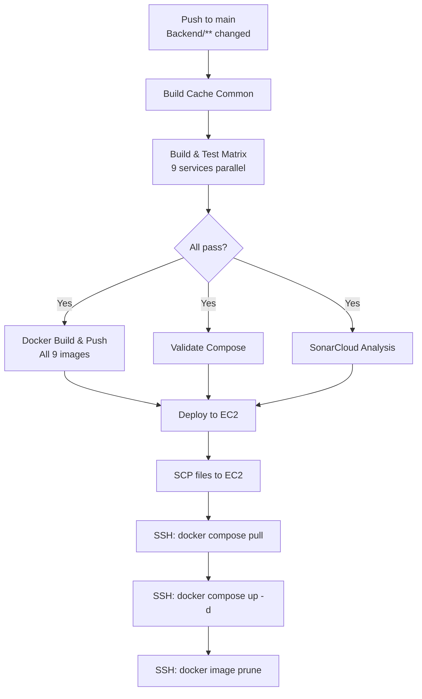

# Document 11: Deployment Architecture & Flow

> Version: 1.0 | Date: 2026-04-01 | Status: Post-Audit

## 1. Infrastructure Overview

| Component | Platform | URL | Notes |
|-----------|----------|-----|-------|
| Frontend | Vercel | `https://skillsync.mraks.dev` | React SPA (Vite + TailwindCSS) |
| Backend API | AWS EC2 | `https://api.skillsync.mraks.dev` | Docker Compose, 9 services |
| DNS | Cloudflare | `mraks.dev` zone | Proxy mode (orange cloud) |
| SSL | Cloudflare | Edge SSL | **No origin SSL (Certbot not configured)** |
| Container Registry | Docker Hub | `aksahoo1097/skillsync` | Tags: eureka, config, gateway, auth, user, skill, session, payment, notification |

## 2. DNS Configuration

```
skillsync.mraks.dev      → Vercel (CNAME to cname.vercel-dns.com)
api.skillsync.mraks.dev  → EC2 Public IP (A record, Cloudflare proxied)
```

> ⚠️ Cloudflare SSL mode MUST be "Full" (not "Full Strict") unless Certbot is configured on EC2 origin.

## 3. CI/CD Pipeline



### Trigger Conditions
- `push` to `main` branch with changes in `Backend/**` or `.github/workflows/**`
- `pull_request` to `main` (build + test only, no deploy)
- `workflow_dispatch` (manual trigger)

### Deploy Stage Requirements
- Only runs on `push` to `main` (not PRs)
- Depends on: `docker` (images pushed), `validate-compose`, `code-quality`

## 4. Docker Compose Architecture

### Service Startup Order

```
postgres, rabbitmq, redis → eureka-server → config-server → microservices → api-gateway
```

### Container Resource Limits

| Service | Memory Limit | Exposed Ports |
|---------|-------------|---------------|
| PostgreSQL | 512M | None (internal) |
| RabbitMQ | 512M | 5672, 15672 |
| Redis | 256M | 6379 |
| Eureka | 384M | 8761 |
| Config Server | 384M | None |
| API Gateway | 384M | 80, 8080 |
| Auth Service | 448M | None |
| User Service | 448M | None |
| Skill Service | 448M | None |
| Session Service | 448M | None |
| Notification Service | 448M | None |
| Payment Service | 448M | None |
| Prometheus | 384M | 9090 |
| Grafana | 256M | 3000 |
| Loki | 256M | 3100 |
| Zipkin | 384M | 9411 |

**Total estimated memory:** ~6.5 GB minimum

### JVM Settings
All Java services: `-Xms256m -Xmx512m -XX:+UseG1GC -XX:+UseContainerSupport`

## 5. Deployment Procedure (Manual)

### First-Time Setup
```bash
# On EC2 instance
cd ~/SkillSync/Backend
cp .env.example .env
# Edit .env with production secrets
nano .env

# Start all services
docker compose pull
docker compose up -d

# Verify
docker compose ps
curl http://localhost/health
```

### Rolling Update (CI/CD Automated)
```bash
cd ~/SkillSync/Backend
git pull origin main
docker compose pull          # Pull new images
docker compose up -d --remove-orphans  # Replace containers
docker image prune -f        # Clean old images
```

### Rollback
```bash
# Use a specific commit SHA tag
docker compose pull aksahoo1097/skillsync:gateway-<previous-sha>
docker compose up -d api-gateway
```

## 6. Health Checks

| Endpoint | Expected | Timeout | Check |
|----------|----------|---------|-------|
| `https://api.skillsync.mraks.dev/health` | `{"status":"UP"}` | 5s | Application health |
| `https://api.skillsync.mraks.dev/actuator/health` | `{"status":"UP"}` | 10s | Spring Boot health |
| `http://localhost:8761` (EC2 only) | Eureka dashboard | 10s | Service discovery |
| `http://localhost:9090` (EC2 only) | Prometheus UI | 5s | Metrics collection |

## 7. Monitoring Stack

| Tool | Purpose | URL (EC2 internal) |
|------|---------|-------------------|
| Prometheus | Metrics scraping | `http://localhost:9090` |
| Grafana | Dashboards | `http://localhost:3000` (admin/skillsync) |
| Loki | Log aggregation | `http://localhost:3100` |
| Zipkin | Distributed tracing | `http://localhost:9411` |

## 8. Known Issues

1. **No origin SSL** — EC2 relies entirely on Cloudflare proxy for HTTPS
2. **Debug ports exposed** — Monitoring UIs accessible from internet if security groups allow
3. **No auto-scaling** — Single EC2 instance, no load balancer
4. **No post-deploy health check** — CI/CD doesn't verify deployment success
5. **Backend currently returning 502** — Containers may be down (as of audit date)
