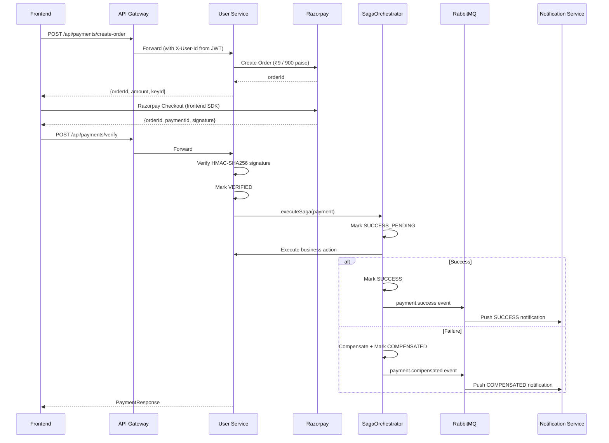
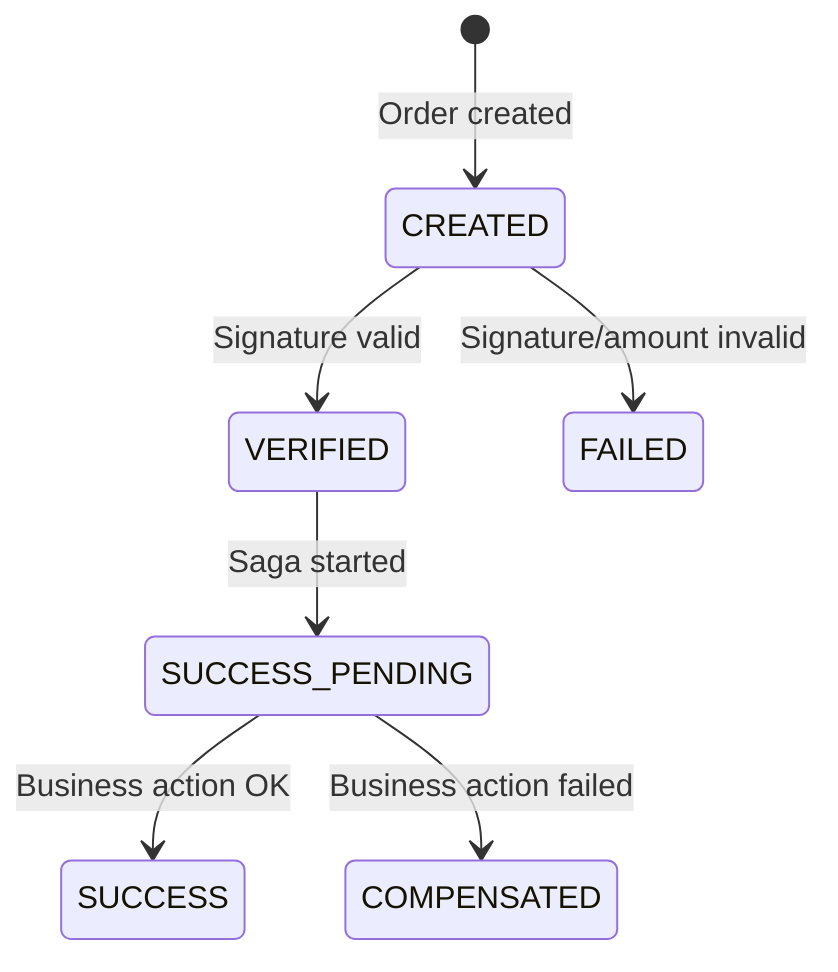

# 💰 Razorpay Payment System — Implementation Summary

> [!IMPORTANT]
> **Upgrade (March 2026):** Payment system has been upgraded to production-grade with Saga orchestration, compensation strategy, reference mapping, payment notifications, and security improvements. See [payment_upgrade_summary.md](file:///f:/SkillSync/docs/payment_upgrade_summary.md) for full upgrade details.

## Architecture Decision
Payment is implemented **inside User Service** (no new microservice) following the existing flat layered structure, with an **orchestration-based Saga pattern** for post-payment business actions.

> In production at scale, this should be extracted into a dedicated **Payment Microservice** using message brokers (Kafka/RabbitMQ) for event-driven choreography or centralized orchestration.

---

## Files Created

### Enums
| File | Purpose |
|------|---------|
| [PaymentType.java](file:///f:/SkillSync/user-service/src/main/java/com/skillsync/user/enums/PaymentType.java) | `MENTOR_FEE`, `SESSION_BOOKING` |
| [PaymentStatus.java](file:///f:/SkillSync/user-service/src/main/java/com/skillsync/user/enums/PaymentStatus.java) | `CREATED`, `VERIFIED`, `SUCCESS_PENDING`, `SUCCESS`, `FAILED`, `COMPENSATED` |
| [ReferenceType.java](file:///f:/SkillSync/user-service/src/main/java/com/skillsync/user/enums/ReferenceType.java) | `MENTOR_ONBOARDING`, `SESSION_BOOKING` — classifies business context |

### Entity
| File | Purpose |
|------|---------|
| [Payment.java](file:///f:/SkillSync/user-service/src/main/java/com/skillsync/user/entity/Payment.java) | JPA entity — `users` schema, stores orderId/paymentId/status/referenceId/referenceType/compensationReason |

### Repository
| File | Purpose |
|------|---------|
| [PaymentRepository.java](file:///f:/SkillSync/user-service/src/main/java/com/skillsync/user/repository/PaymentRepository.java) | Lookup by orderId, idempotency queries, reference-based duplicate checks, user history |

### DTOs
| File | Purpose |
|------|---------|
| [CreateOrderRequest.java](file:///f:/SkillSync/user-service/src/main/java/com/skillsync/user/dto/CreateOrderRequest.java) | Input: type + referenceId (mandatory) + referenceType (mandatory) |
| [CreateOrderResponse.java](file:///f:/SkillSync/user-service/src/main/java/com/skillsync/user/dto/CreateOrderResponse.java) | Output: orderId, amount, currency, Razorpay key |
| [VerifyPaymentRequest.java](file:///f:/SkillSync/user-service/src/main/java/com/skillsync/user/dto/VerifyPaymentRequest.java) | Input: orderId + paymentId + signature |
| [PaymentResponse.java](file:///f:/SkillSync/user-service/src/main/java/com/skillsync/user/dto/PaymentResponse.java) | Response: includes referenceType + compensationReason |

### Service, Orchestrator & Controller
| File | Purpose |
|------|---------|
| [PaymentService.java](file:///f:/SkillSync/user-service/src/main/java/com/skillsync/user/service/PaymentService.java) | Order creation, verification, delegates to saga orchestrator |
| [PaymentSagaOrchestrator.java](file:///f:/SkillSync/user-service/src/main/java/com/skillsync/user/service/PaymentSagaOrchestrator.java) | Saga orchestration: state transitions, business actions, compensation, notification events |
| [PaymentController.java](file:///f:/SkillSync/user-service/src/main/java/com/skillsync/user/controller/PaymentController.java) | 5 REST endpoints (all secured via X-User-Id header) |

### Event & Config
| File | Purpose |
|------|---------|
| [PaymentCompletedEvent.java](file:///f:/SkillSync/user-service/src/main/java/com/skillsync/user/event/PaymentCompletedEvent.java) | RabbitMQ event DTO for payment notifications |
| [RazorpayConfig.java](file:///f:/SkillSync/user-service/src/main/java/com/skillsync/user/config/RazorpayConfig.java) | `RazorpayClient` bean from env vars |
| [PaymentException.java](file:///f:/SkillSync/user-service/src/main/java/com/skillsync/user/exception/PaymentException.java) | Custom exception with error codes + HTTP status |

### Notification Service (Payment Consumer)
| File | Purpose |
|------|---------|
| [PaymentEventConsumer.java](file:///f:/SkillSync/notification-service/src/main/java/com/skillsync/notification/consumer/PaymentEventConsumer.java) | Consumes payment.success/failed/compensated events, pushes user notifications |

---

## Files Modified

| File | Change |
|------|--------|
| [pom.xml](file:///f:/SkillSync/user-service/pom.xml) | Added `razorpay-java:1.4.8` dependency |
| [application.properties](file:///f:/SkillSync/user-service/src/main/resources/application.properties) | Added `razorpay.api.key/secret` with env var + fallback defaults |
| [GlobalExceptionHandler.java](file:///f:/SkillSync/user-service/src/main/java/com/skillsync/user/exception/GlobalExceptionHandler.java) | Dynamic HTTP status from PaymentException + MissingRequestHeaderException handler |
| [MentorService.java](file:///f:/SkillSync/user-service/src/main/java/com/skillsync/user/service/MentorService.java) | Added `revertMentorApproval()` compensation method |
| [RabbitMQConfig (user-service)](file:///f:/SkillSync/user-service/src/main/java/com/skillsync/user/config/RabbitMQConfig.java) | Added payment.exchange with 3 queues |
| [RabbitMQConfig (notification-service)](file:///f:/SkillSync/notification-service/src/main/java/com/skillsync/notification/config/RabbitMQConfig.java) | Added payment notification consumer queues |
| [api-gateway application.properties](file:///f:/SkillSync/api-gateway/src/main/resources/application.properties) | Added `/api/payments/**` route with JWT filter (index 8) |

---

## API Endpoints

```
POST   /api/payments/create-order     — Create Razorpay order (X-User-Id header, mandatory referenceId + referenceType)
POST   /api/payments/verify           — Verify payment → Saga orchestration → notifications
GET    /api/payments/my-payments      — User's payment history (X-User-Id header)
GET    /api/payments/order/{orderId}  — Lookup by orderId (ownership validated)
GET    /api/payments/check?type=      — Inter-service payment check (X-User-Id header, NOT @RequestParam userId)
```

> [!WARNING]
> **Security:** All endpoints use `X-User-Id` header from JWT (set by API Gateway). No endpoint accepts userId via request params or body.

---

## Payment Flow (with Saga Orchestration)



---

## Payment Status State Machine



---

## Notification Events (RabbitMQ)

| Exchange | Routing Key | Trigger | Notification Type |
|----------|------------|---------|-------------------|
| `payment.exchange` | `payment.success` | Saga completes successfully | `PAYMENT_SUCCESS` |
| `payment.exchange` | `payment.failed` | Signature/amount verification fails | `PAYMENT_FAILED` |
| `payment.exchange` | `payment.compensated` | Business action fails after verification | `PAYMENT_COMPENSATED` |

---

## Edge Cases Handled

| Edge Case | Handling |
|-----------|----------|
| Duplicate mentor fee payment | Blocked at order creation — checks for existing SUCCESS payment |
| Duplicate reference payment | Blocked — checks for active (CREATED/VERIFIED/SUCCESS_PENDING) payments on same reference |
| Duplicate verification request | Idempotent — returns existing state for SUCCESS/COMPENSATED/SUCCESS_PENDING |
| Invalid signature | Marks FAILED, publishes payment.failed event, returns `SIGNATURE_INVALID` |
| Re-verifying failed payment | Blocked — must create a new order |
| Business action fails after payment | Compensation triggered — marks COMPENSATED, reverts business effects, publishes event |
| Amount mismatch | Marks FAILED, returns `AMOUNT_MISMATCH` |
| Order ID not found | Returns `ORDER_NOT_FOUND` (404) |
| Wrong user tries to verify | Returns `UNAUTHORIZED_ACCESS` (403) |
| Missing X-User-Id header | Returns `UNAUTHORIZED_ACCESS` (401) |
| PaymentType/ReferenceType mismatch | Returns `INVALID_REFERENCE` (400) |

---

## Error Code Reference

| Error Code | HTTP Status | Description |
|------------|-------------|-------------|
| `ORDER_NOT_FOUND` | 404 | Payment order doesn't exist |
| `UNAUTHORIZED_ACCESS` | 403 | Payment doesn't belong to user |
| `SIGNATURE_INVALID` | 400 | Razorpay signature verification failed |
| `AMOUNT_MISMATCH` | 400 | Server-side amount doesn't match |
| `DUPLICATE_PAYMENT` | 409 | Payment already exists for this reference |
| `INVALID_REFERENCE` | 400 | PaymentType/ReferenceType mismatch |
| `PAYMENT_ALREADY_FAILED` | 400 | Cannot re-process failed payment |
| `ORDER_CREATION_FAILED` | 400 | Razorpay API failure |

---

## Razorpay Credentials

```properties
# Env vars (for Docker / production)
RAZORPAY_API_KEY=rzp_test_SUxK0KnvPwKuAT
RAZORPAY_API_SECRET=p0fqspCZHi7jVd24czBGwbf8

# Defaults already in application.properties for local dev
```

> [!WARNING]
> These are **test credentials**. Replace with production keys before deploying.
