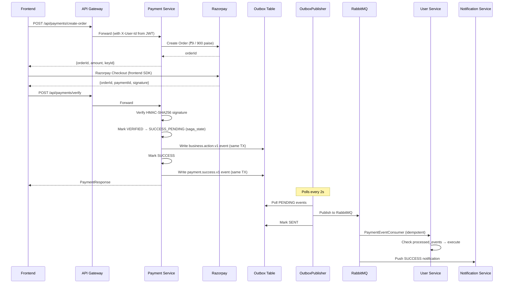
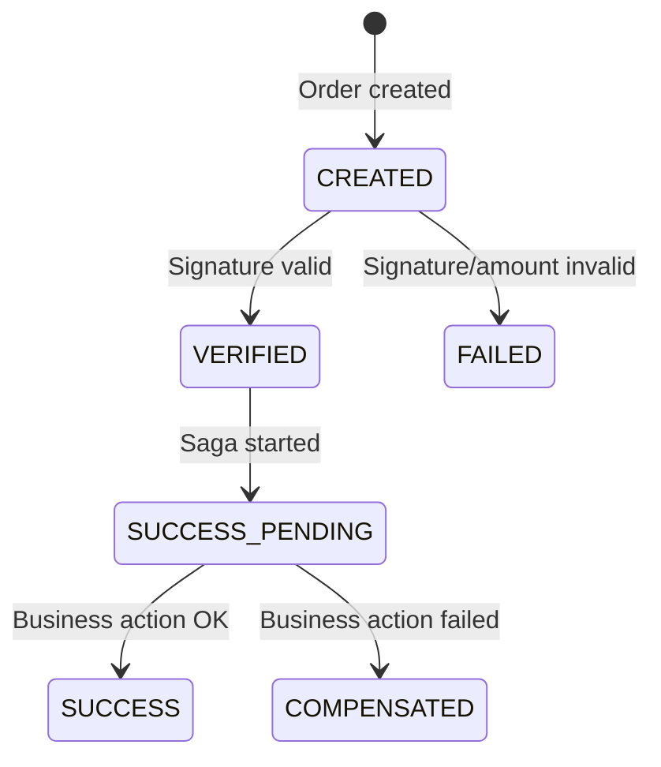

# 💰 Payment Service — Standalone Microservice Implementation

> [!IMPORTANT]
> **Extraction (March 2026):** Payment has been **extracted from User Service** into a dedicated **Payment Service** (port 8086, package `com.skillsync.payment`). The Saga is now **event-driven** — the orchestrator publishes `payment.business.action.v1` events to RabbitMQ via the **Outbox Pattern**, consumed by User Service's `PaymentEventConsumer` (with **idempotency check**) to execute business actions (mentor approval, etc.).
>
> **Production Hardening (March 2026):** Outbox Pattern for reliable event delivery, Dead Letter Queues (DLQ), Event Versioning (v1), Saga State Persistence, Resilience4j Circuit Breaker, Payment Rate Limiting (10 req/min), Consumer Idempotency (processed_events table), Database Indexes.

## Architecture

```
Payment Service (port 8086)                               User Service (port 8082)
┌─────────────────────────────────────────┐                ┌──────────────────────────────────┐
│ PaymentController                       │                │ PaymentEventConsumer             │
│ DlqReplayController (/internal/dlq)     │                │  ├→ idempotency (processed_events)│
│ PaymentService                          │                │  └→ MentorCommandService          │
│ PaymentSagaOrchestrator                 │                │      .approveMentor()             │
│  └→ writes to outbox_events (same TX)   │                └──────────────────────────────────┘
│ OutboxPublisher (2s scheduler)          │
│  └→ FOR UPDATE SKIP LOCKED ────────────┼──MQ(v1)──→─┘
│  └→ Publisher Confirms (ACK/NACK)       │                Dead Letter Queues
│ DlqConsumer → failed_events table       │                ┌─────────────────────┐
│ DlqReplayService → safe replay          │                │ payment.*.dlq       │
│ SagaRecoveryScheduler (5min)            │                └─────────────────────┘
│ Circuit Breaker (Resilience4j)          │
│                                         │
│ Tables: payments, outbox_events,        │
│         saga_state, failed_events        │
│ Database: skillsync_payment              │
└─────────────────────────────────────────┘
```

**Database:** `skillsync_payment` | **Schema:** `payments`

---

## Files (Payment Service)

### Core
| File | Purpose |
|------|---------|
| [PaymentServiceApplication.java](file:///f:/SkillSync/payment-service/src/main/java/com/skillsync/payment/PaymentServiceApplication.java) | `@SpringBootApplication` + `@EnableFeignClients` + `@EnableScheduling` |
| [pom.xml](file:///f:/SkillSync/payment-service/pom.xml) | Maven dependencies (Razorpay SDK, Spring AMQP, JPA, Resilience4j, Micrometer Tracing) |
| [application.properties](file:///f:/SkillSync/payment-service/src/main/resources/application.properties) | Port 8086, DB config, RabbitMQ retry/DLQ, Razorpay, Resilience4j CircuitBreaker, Eureka |
| [Dockerfile](file:///f:/SkillSync/payment-service/Dockerfile) | Multi-stage build |

### Enums
| File | Purpose |
|------|---------|
| [PaymentType.java](file:///f:/SkillSync/payment-service/src/main/java/com/skillsync/payment/enums/PaymentType.java) | `MENTOR_FEE`, `SESSION_BOOKING` |
| [PaymentStatus.java](file:///f:/SkillSync/payment-service/src/main/java/com/skillsync/payment/enums/PaymentStatus.java) | `CREATED`, `VERIFIED`, `SUCCESS_PENDING`, `SUCCESS`, `FAILED`, `COMPENSATED` |
| [ReferenceType.java](file:///f:/SkillSync/payment-service/src/main/java/com/skillsync/payment/enums/ReferenceType.java) | `MENTOR_ONBOARDING`, `SESSION_BOOKING` |

### Entity & Repository
| File | Purpose |
|------|---------|
| [Payment.java](file:///f:/SkillSync/payment-service/src/main/java/com/skillsync/payment/entity/Payment.java) | JPA entity — `payments` schema (with DB indexes) |
| [OutboxEvent.java](file:///f:/SkillSync/payment-service/src/main/java/com/skillsync/payment/entity/OutboxEvent.java) | Transactional Outbox entity (PENDING → PROCESSING → SENT / FAILED) |
| [SagaState.java](file:///f:/SkillSync/payment-service/src/main/java/com/skillsync/payment/entity/SagaState.java) | Saga state persistence for recovery on restart |
| [FailedEvent.java](file:///f:/SkillSync/payment-service/src/main/java/com/skillsync/payment/entity/FailedEvent.java) | DLQ event persistence for admin review & replay |
| [PaymentRepository.java](file:///f:/SkillSync/payment-service/src/main/java/com/skillsync/payment/repository/PaymentRepository.java) | Idempotency queries, reference-based duplicate checks, user history |
| [OutboxEventRepository.java](file:///f:/SkillSync/payment-service/src/main/java/com/skillsync/payment/repository/OutboxEventRepository.java) | FOR UPDATE SKIP LOCKED queries, stale PROCESSING recovery |
| [SagaStateRepository.java](file:///f:/SkillSync/payment-service/src/main/java/com/skillsync/payment/repository/SagaStateRepository.java) | Find by paymentId, find stale sagas for recovery |
| [FailedEventRepository.java](file:///f:/SkillSync/payment-service/src/main/java/com/skillsync/payment/repository/FailedEventRepository.java) | DLQ replay queries (find by eventId, status) |

### DTOs & Mapper
| File | Purpose |
|------|---------|
| [CreateOrderRequest.java](file:///f:/SkillSync/payment-service/src/main/java/com/skillsync/payment/dto/CreateOrderRequest.java) | Input: type + referenceId + referenceType |
| [CreateOrderResponse.java](file:///f:/SkillSync/payment-service/src/main/java/com/skillsync/payment/dto/CreateOrderResponse.java) | Output: orderId, amount, currency, Razorpay key |
| [VerifyPaymentRequest.java](file:///f:/SkillSync/payment-service/src/main/java/com/skillsync/payment/dto/VerifyPaymentRequest.java) | Input: orderId + paymentId + signature |
| [PaymentResponse.java](file:///f:/SkillSync/payment-service/src/main/java/com/skillsync/payment/dto/PaymentResponse.java) | Response: includes referenceType + compensationReason |
| [PaymentMapper.java](file:///f:/SkillSync/payment-service/src/main/java/com/skillsync/payment/mapper/PaymentMapper.java) | Pure static mapping (CQRS-compliant) |

### Service, Saga & Outbox
| File | Purpose |
|------|---------|
| [PaymentService.java](file:///f:/SkillSync/payment-service/src/main/java/com/skillsync/payment/service/PaymentService.java) | Order creation, verification, delegates to saga (uses OutboxEventService) |
| [PaymentSagaOrchestrator.java](file:///f:/SkillSync/payment-service/src/main/java/com/skillsync/payment/service/PaymentSagaOrchestrator.java) | **Event-driven Saga** with state persistence — writes events to outbox |
| [OutboxEventService.java](file:///f:/SkillSync/payment-service/src/main/java/com/skillsync/payment/service/OutboxEventService.java) | Atomically writes events to outbox table (Propagation.MANDATORY) |
| [OutboxPublisher.java](file:///f:/SkillSync/payment-service/src/main/java/com/skillsync/payment/service/OutboxPublisher.java) | Publisher Confirms + FOR UPDATE SKIP LOCKED, PROCESSING state, metrics |
| [SagaRecoveryScheduler.java](file:///f:/SkillSync/payment-service/src/main/java/com/skillsync/payment/service/SagaRecoveryScheduler.java) | Detects stuck sagas, retries or compensates automatically |
| [DlqReplayService.java](file:///f:/SkillSync/payment-service/src/main/java/com/skillsync/payment/service/DlqReplayService.java) | Safe DLQ replay — preserves original eventId for idempotency |
| [DlqConsumer.java](file:///f:/SkillSync/payment-service/src/main/java/com/skillsync/payment/consumer/DlqConsumer.java) | Persists DLQ events to failed_events table for admin review |

### Controller, Events & Config
| File | Purpose |
|------|---------|
| [PaymentController.java](file:///f:/SkillSync/payment-service/src/main/java/com/skillsync/payment/controller/PaymentController.java) | 5 REST endpoints (all secured via X-User-Id header) |
| [DlqReplayController.java](file:///f:/SkillSync/payment-service/src/main/java/com/skillsync/payment/controller/DlqReplayController.java) | Internal admin endpoints for DLQ replay/skip/list (/internal/dlq/*) |
| [PaymentCompletedEvent.java](file:///f:/SkillSync/payment-service/src/main/java/com/skillsync/payment/event/PaymentCompletedEvent.java) | Versioned RabbitMQ event DTO (@JsonIgnoreProperties for schema evolution) |
| [PaymentException.java](file:///f:/SkillSync/payment-service/src/main/java/com/skillsync/payment/exception/PaymentException.java) | Custom exception with error codes + HTTP status |
| [GlobalExceptionHandler.java](file:///f:/SkillSync/payment-service/src/main/java/com/skillsync/payment/exception/GlobalExceptionHandler.java) | Payment-specific error handling + MissingRequestHeader → 401 |
| [RazorpayConfig.java](file:///f:/SkillSync/payment-service/src/main/java/com/skillsync/payment/config/RazorpayConfig.java) | `RazorpayClient` bean from env vars |
| [RabbitMQConfig.java](file:///f:/SkillSync/payment-service/src/main/java/com/skillsync/payment/config/RabbitMQConfig.java) | Versioned exchanges, queues, DLQ bindings, schema-safe converter |
| [OpenApiConfig.java](file:///f:/SkillSync/payment-service/src/main/java/com/skillsync/payment/config/OpenApiConfig.java) | Swagger/OpenAPI config |

### Tests (27 unit tests — all pass ✅)
| File | Tests |
|------|-------|
| [PaymentMapperTest.java](file:///f:/SkillSync/payment-service/src/test/java/com/skillsync/payment/mapper/PaymentMapperTest.java) | 3 tests — pure function mapping |
| [PaymentSagaOrchestratorTest.java](file:///f:/SkillSync/payment-service/src/test/java/com/skillsync/payment/service/PaymentSagaOrchestratorTest.java) | 5 tests — saga transitions, outbox event writing, compensation, state validation |
| [PaymentServiceTest.java](file:///f:/SkillSync/payment-service/src/test/java/com/skillsync/payment/service/PaymentServiceTest.java) | 5 tests — queries, ownership validation |
| [OutboxPublisherTest.java](file:///f:/SkillSync/payment-service/src/test/java/com/skillsync/payment/service/OutboxPublisherTest.java) | 4 tests — publisher confirms ACK/NACK, crash recovery, empty batch |
| [DlqReplayServiceTest.java](file:///f:/SkillSync/payment-service/src/test/java/com/skillsync/payment/service/DlqReplayServiceTest.java) | 4 tests — replay, skip, already-replayed, not-found |
| [SagaRecoverySchedulerTest.java](file:///f:/SkillSync/payment-service/src/test/java/com/skillsync/payment/service/SagaRecoverySchedulerTest.java) | 3 tests — stale saga retry, max retries compensation, empty |
| [PaymentCompletedEventSchemaTest.java](file:///f:/SkillSync/payment-service/src/test/java/com/skillsync/payment/event/PaymentCompletedEventSchemaTest.java) | 3 tests — forward/backward compatibility, roundtrip |

---

## User Service Changes

### New/Updated Files
| File | Purpose |
|------|---------|
| [PaymentEventConsumer.java](file:///f:/SkillSync/user-service/src/main/java/com/skillsync/user/consumer/PaymentEventConsumer.java) | Consumes `payment.business.action.v1` events with **idempotency check** → triggers `MentorCommandService.approveMentor()` |
| [ProcessedEvent.java](file:///f:/SkillSync/user-service/src/main/java/com/skillsync/user/entity/ProcessedEvent.java) | Tracks processed eventIds for consumer-level idempotency |
| [ProcessedEventRepository.java](file:///f:/SkillSync/user-service/src/main/java/com/skillsync/user/repository/ProcessedEventRepository.java) | `existsByEventId()` for dedup check |

### Removed from User Service
- `PaymentController`, `PaymentService`, `PaymentSagaOrchestrator`
- `Payment` entity, `PaymentRepository`
- `PaymentType`, `PaymentStatus`, `ReferenceType` enums
- `CreateOrderRequest`, `CreateOrderResponse`, `VerifyPaymentRequest`, `PaymentResponse` DTOs
- `PaymentCompletedEvent`, `PaymentException`, `PaymentMapper`
- `RazorpayConfig`, Razorpay SDK dependency
- `PaymentException` handler from `GlobalExceptionHandler`

---

## API Endpoints (via API Gateway)

```
POST   /api/payments/create-order     — Create Razorpay order (X-User-Id header, mandatory referenceId + referenceType)
POST   /api/payments/verify           — Verify payment → Saga orchestration → notifications
GET    /api/payments/my-payments      — User's payment history (X-User-Id header)
GET    /api/payments/order/{orderId}  — Lookup by orderId (ownership validated)
GET    /api/payments/check?type=      — Inter-service payment check (X-User-Id header)
```

> [!WARNING]
> **Security:** All endpoints use `X-User-Id` header from JWT (set by API Gateway). No endpoint accepts userId via request params or body.

---

## Payment Flow (Event-Driven Saga with Outbox)



---

## Payment Status State Machine



---

## RabbitMQ Event Topology (Versioned + DLQ)

| Exchange | Routing Key | Queue | DLQ | Consumer | Purpose |
|----------|------------|-------|-----|----------|---------|
| `payment.exchange` | `payment.business.action.v1` | `payment.business.action.v1.queue` | `payment.business.action.dlq` | User Service | Triggers business actions |
| `payment.exchange` | `payment.success.v1` | `payment.success.v1.queue` | `payment.success.dlq` | Notification Service | Success notification |
| `payment.exchange` | `payment.failed.v1` | `payment.failed.v1.queue` | `payment.failed.dlq` | Notification Service | Failure notification |
| `payment.exchange` | `payment.compensated.v1` | `payment.compensated.v1.queue` | — | Notification Service | Compensation notification |
| `payment.dlx.exchange` | (DLQ routing keys) | DLQ queues | — | DlqConsumer | Logs failed events |

---

## Edge Cases Handled

| Edge Case | Handling |
|-----------|----------|
| Duplicate mentor fee payment | Blocked at order creation — checks for existing SUCCESS payment |
| Duplicate reference payment | Blocked — checks for active (CREATED/VERIFIED/SUCCESS_PENDING) payments on same reference |
| Duplicate verification request | Idempotent — returns existing state for SUCCESS/COMPENSATED/SUCCESS_PENDING |
| Invalid signature | Marks FAILED, publishes payment.failed event, returns `SIGNATURE_INVALID` |
| Re-verifying failed payment | Blocked — must create a new order |
| Business action fails after payment | Compensation triggered — marks COMPENSATED, reverts business effects, publishes event |
| Amount mismatch | Marks FAILED, returns `AMOUNT_MISMATCH` |
| Order ID not found | Returns `ORDER_NOT_FOUND` (404) |
| Wrong user tries to verify | Returns `UNAUTHORIZED_ACCESS` (403) |
| Missing X-User-Id header | Returns `MISSING_AUTH_HEADER` (401) |
| PaymentType/ReferenceType mismatch | Returns `INVALID_REFERENCE` (400) |
| Duplicate event consumed | Silently skipped via `processed_events` table |
| RabbitMQ down during publish | Event stays in outbox as PENDING, retried by OutboxPublisher |
| Consumer fails after retries | Message routed to DLQ for manual review |
| Razorpay API timeout | Circuit breaker opens after 50% failure rate (5+ calls) |

---

## 🏗️ Advanced Reliability Mechanisms

### 1. Outbox Confirmation Flow (Safe Publishing)
To prevent duplicate publishing completely, the Outbox pattern must be crash-safe.
* **FOR UPDATE SKIP LOCKED:** The `OutboxPublisher` uses distributed database locks when claiming `PENDING` events. Multiple service instances can poll the outbox table simultaneously without processing the same event.
* **Publisher Confirms:** When an event is published, the status is changed to `PROCESSING`. The publisher **waits for a broker ACK** (`CorrelationData.Confirm`) within a timeout (5s) before marking the row as `SENT`. 
* **Crash Recovery:** If the publisher crashes while a row is `PROCESSING` (broker ACK pending), the `SagaRecoveryScheduler` detects the stale row via `lastAttemptAt` timestamp and automatically transitions it to `FAILED` for retry.

### 2. DLQ Replay Architecture
Failed RabbitMQ events are no longer just logged; they are dynamically persisted and replayed.
* **Persistence:** `DlqConsumer` listens to DLX queues (`*.dlq`) and persists failures into the `failed_events` DB table (stores `eventId`, full payload, original routing key, and error reason).
* **Safe Replay Strategy:** The `DlqReplayController` provides internal admin endpoints (`/internal/dlq/replay/{eventId}`).
* **Idempotency Guarantee:** When replayed, the event is re-published with its **original `eventId`**. If the consumer already processed it (but failed to ACK properly), the `processed_events` dedup check automatically drops it safely.

### 3. Saga Timeout & Recovery Design
Solves the issue of sagas getting "stuck" in intermediate states (e.g., `SUCCESS_PENDING` forever).
* **Scheduler Detection:** `SagaRecoveryScheduler` runs every 5 minutes and detects `SagaState` rows stuck in `SUCCESS_PENDING` past their timeout threshold.
* **Auto-Recovery:** It automatically re-publishes the business action event via the outbox to retry completing the saga.
* **Compensation on Max Retries:** If recovery attempts exceed `saga.recovery.max-retries` (default: 3), the payment is automatically demoted to `COMPENSATED` and a rollback event is published.

### 4. Event Versioning & Schema Evolution
To ensure future enhancements do not break existing consumers:
* **Headers:** All RabbitMQ events include `x-event-version` (currently `1`) and publish to versioned routing keys (e.g., `payment.success.v1`).
* **Additive Changes Only:** New fields to `PaymentCompletedEvent` must be strictly optional.
* **Consumer Safety:** Consumers use Jackson `@JsonIgnoreProperties(ignoreUnknown = true)` and `DeserializationFeature.FAIL_ON_UNKNOWN_PROPERTIES = false`. Unknown properties in newer event versions are safely ignored by older consumers.

---
## Razorpay Credentials

```properties
# Env vars (for Docker / production)
RAZORPAY_API_KEY=rzp_test_SUxK0KnvPwKuAT
RAZORPAY_API_SECRET=p0fqspCZHi7jVd24czBGwbf8

# Defaults already in application.properties for local dev
```

> [!WARNING]
> These are **test credentials**. Replace with production keys before deploying.
