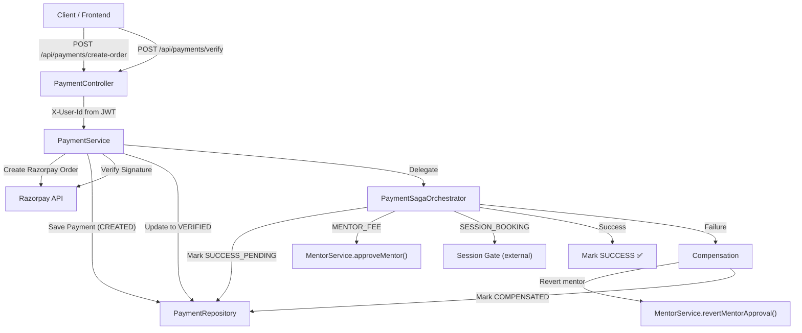
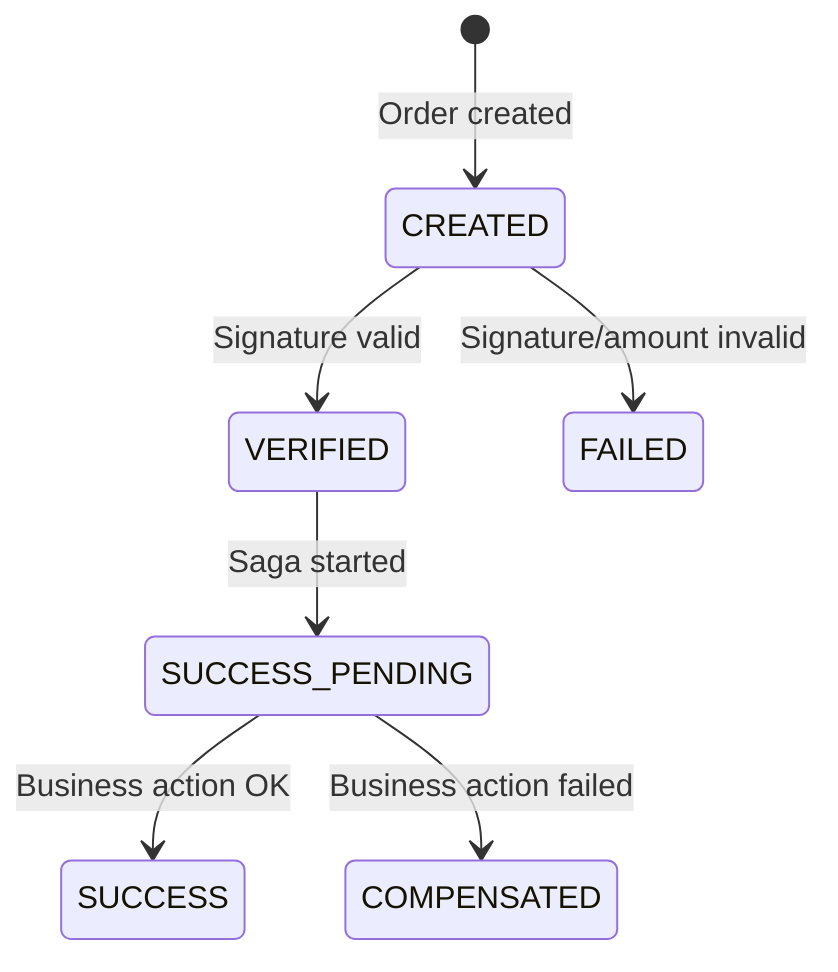

# Payment System Upgrade — Production-Grade Saga Pattern

> [!IMPORTANT]
> All changes compile successfully. ✅ Build verified with `mvn compile`.

---

## Architecture Overview



---

## Payment Status State Machine



| Status | Description |
|--------|-------------|
| `CREATED` | Razorpay order created, awaiting frontend checkout |
| `VERIFIED` | Razorpay signature verified successfully |
| `SUCCESS_PENDING` | Business action (saga step) in progress |
| `SUCCESS` | Payment fully completed — business action succeeded |
| `FAILED` | Payment verification failed |
| `COMPENSATED` | Payment verified but business action failed — compensation applied |

---

## Files Changed

### New Files

| File | Purpose |
|------|---------|
| [ReferenceType.java](file:///f:/SkillSync/user-service/src/main/java/com/skillsync/user/enums/ReferenceType.java) | Enum: `MENTOR_ONBOARDING`, `SESSION_BOOKING` — classifies business context |
| [PaymentSagaOrchestrator.java](file:///f:/SkillSync/user-service/src/main/java/com/skillsync/user/service/PaymentSagaOrchestrator.java) | Saga orchestration: state transitions, business actions, compensation, notification events |
| [PaymentCompletedEvent.java](file:///f:/SkillSync/user-service/src/main/java/com/skillsync/user/event/PaymentCompletedEvent.java) | RabbitMQ event DTO for payment lifecycle notifications |
| [PaymentEventConsumer.java](file:///f:/SkillSync/notification-service/src/main/java/com/skillsync/notification/consumer/PaymentEventConsumer.java) | Notification service consumer for payment.success/failed/compensated events |

### Modified Files

````carousel
#### PaymentStatus.java
```diff
 CREATED,
+VERIFIED,
+SUCCESS_PENDING,
 SUCCESS,
 FAILED,
+COMPENSATED
```
Added 3 new states to support saga lifecycle.
<!-- slide -->
#### Payment.java (Entity)
```diff
-@Column(nullable = false, length = 10)
+@Column(nullable = false, length = 20)
 private PaymentStatus status;

+@Column(nullable = false)
 private Long referenceId;

+@Enumerated(EnumType.STRING)
+@Column(nullable = false, length = 30)
+private ReferenceType referenceType;

+@Column(length = 500)
+private String compensationReason;
```
- `referenceId` now **non-nullable** — every payment must be linked to a business entity
- Added `referenceType` enum for traceability
- Added `compensationReason` for debugging failed sagas
<!-- slide -->
#### CreateOrderRequest.java (DTO)
```diff
+@NotNull(message = "Reference ID is required")
 Long referenceId,
+
+@NotNull(message = "Reference type is required")
+ReferenceType referenceType
```
Both fields are now **mandatory** — no payment without context.
<!-- slide -->
#### PaymentResponse.java (DTO)
```diff
 Long referenceId,
+String referenceType,
+String compensationReason,
 LocalDateTime createdAt,
```
API responses now include full reference mapping and compensation info.
<!-- slide -->
#### PaymentController.java
```diff
 @GetMapping("/check")
 public ResponseEntity<Boolean> checkPaymentStatus(
-        @RequestParam Long userId,
+        @RequestHeader("X-User-Id") Long userId,
         @RequestParam PaymentType type)
```
- **Security fix**: Removed `userId` from `@RequestParam` — all endpoints now use `X-User-Id` header
- `getPaymentByOrderId` now validates ownership
<!-- slide -->
#### PaymentService.java
Key changes:
- Verification now transitions: `CREATED → VERIFIED → (saga)`
- Delegates post-payment logic to `PaymentSagaOrchestrator`
- Added `validateReferenceMapping()` — ensures PaymentType/ReferenceType consistency
- Added `preventDuplicatePayment()` — checks active payments on same reference
- `getPaymentByOrderId()` now requires userId for ownership validation
- Enhanced idempotency: returns current state for `SUCCESS`, `COMPENSATED`, `SUCCESS_PENDING`
<!-- slide -->
#### MentorService.java
```diff
+@Transactional
+public void revertMentorApproval(Long mentorId) {
+    // Reverts status APPROVED → PENDING
+    // Reverts role ROLE_MENTOR → ROLE_USER
+}
```
Compensation method for saga rollback.
<!-- slide -->
#### GlobalExceptionHandler.java
- `PaymentException` now uses **dynamic HTTP status** from the exception
- Added `MissingRequestHeaderException` handler → returns `401` for missing `X-User-Id`
- Extracted `buildResponse()` helper with `LinkedHashMap` for consistent key ordering
<!-- slide -->
#### PaymentException.java
```diff
+private final HttpStatus httpStatus;
+
+public PaymentException(String errorCode, String message, HttpStatus httpStatus)
```
Supports per-error HTTP status codes (400, 401, 403, 404, 409, 500).
````

---

## Key Design Decisions

### 1. Saga Orchestration Pattern
- **Why not @Transactional for everything?** Business actions (mentor approval, auth-service calls) involve external services and message queues. A single transaction would hold DB locks too long and can't span services.
- **REQUIRES_NEW propagation** on saga state transitions ensures each step is independently committed, making the system resilient to partial failures.

### 2. Compensation over Rollback
- Razorpay payments **cannot be reversed** once confirmed. The system records the compensation reason and reverts internal state.
- Mentor approval revert is **best-effort** for the auth-service role change — if it fails, the mentor status is still reverted.

### 3. Reference Mapping
- **Every payment must have a `referenceId` + `referenceType`** — this is enforced at the DTO level with `@NotNull`.
- Enables: traceability, duplicate prevention, and debugging.

### 4. Security
- **No endpoint accepts userId from request params or body** — always from `X-User-Id` header (set by API Gateway from JWT).
- Missing header returns `401 UNAUTHORIZED`.
- Cross-user access attempts return `403 FORBIDDEN`.

### 5. Future-Ready
- [PaymentSagaOrchestrator](file:///f:/SkillSync/user-service/src/main/java/com/skillsync/user/service/PaymentSagaOrchestrator.java#36-224) is a separate `@Component` — easy to extract into a standalone service.
- Business actions are modular methods — easy to add new payment types.
- In a distributed system, the orchestrator would use Kafka/RabbitMQ events instead of direct method calls.

### 6. Payment Notifications
- Payment events (`payment.success`, `payment.failed`, `payment.compensated`) are published to RabbitMQ `payment.exchange`.
- Notification Service consumes these events and pushes user-friendly notifications via WebSocket.
- Notification failure does NOT affect payment flow — it is best-effort.

---

## Error Code Reference

| Error Code | HTTP Status | Description |
|------------|-------------|-------------|
| `ORDER_NOT_FOUND` | 404 | Payment order doesn't exist |
| `UNAUTHORIZED_ACCESS` | 403 | Payment doesn't belong to user |
| `SIGNATURE_INVALID` | 400 | Razorpay signature verification failed |
| `AMOUNT_MISMATCH` | 400 | Server-side amount doesn't match |
| `DUPLICATE_PAYMENT` | 409 | Payment already exists for this reference |
| `INVALID_REFERENCE` | 400 | PaymentType/ReferenceType mismatch |
| `PAYMENT_ALREADY_FAILED` | 400 | Cannot re-process failed payment |
| `ORDER_CREATION_FAILED` | 400 | Razorpay API failure |
| `PAYMENT_ERROR` | 400 | Generic payment error |

---

## Database Migration Note

> [!WARNING]
> The `payments` table has schema changes. Since `spring.jpa.hibernate.ddl-auto=update` is configured, Hibernate will auto-apply:
> - `status` column width: 10 → 20 characters
> - `referenceId` column: now `NOT NULL`
> - New column: `reference_type` (`VARCHAR(30)`, `NOT NULL`)
> - New column: `compensation_reason` (`VARCHAR(500)`)
>
> **If existing data has NULL referenceId values**, you may need a migration script before deploying.
