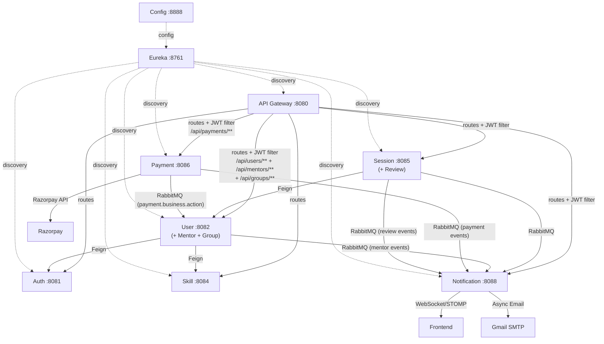

# SkillSync Backend — Service Architecture Summary

> **Branch:** `trail1` | **Base Package:** `com.skillsync` | **ID Type:** Long (all services)
> **Note:** mentor-service and group-service have been **merged into user-service** (March 2026).
> **Payment Extraction:** Payment logic has been **extracted from user-service into a dedicated payment-service** (port 8086) with event-driven Saga orchestration (March 2026).
> **CQRS + Redis:** All business services implement **Command/Query separation** with **Redis 7.2** distributed caching (March 2026).

## ✅ 9 Active Services (after merges + payment extraction)

| # | Service | Port | Package | Key Features |
|---|---------|------|---------|-------------|
| 1 | **Eureka Server** | 8761 | `com.skillsync.eurekaserver` | Service discovery, self-preservation disabled for dev |
| 2 | **Config Server** | 8888 | `com.skillsync.configserver` | Git-backed config (`SkillSync-config` repo), Eureka registered |
| 3 | **API Gateway** | 8080 | `com.skillsync.apigateway` | JWT validation filter, CORS, routes to all microservices |
| 4 | **Auth Service** | 8081 | `com.skillsync.auth` | Registration with **OTP rollback**, **Password Reset (OTP)**, **Google OAuth**, JWT (access + refresh), Redis cache invalidation, role management, BCrypt |
| 5 | **User Service** | 8082 | `com.skillsync.user` | Profile CRUD, skill tagging, **mentor onboarding/approval**, **peer learning groups**, consumes `payment.business.action` events for mentor approval, Feign → Skill/Auth, Redis cache-aside (CQRS) |
| 6 | **Payment Service** | 8086 | `com.skillsync.payment` | **Razorpay payment processing**, Saga orchestration, publishes `payment.business.action` events, payment lifecycle management |
| 7 | **Skill Service** | 8084 | `com.skillsync.skill` | Skill catalog CRUD, category management, search |
| 8 | **Session Service** | 8085 | `com.skillsync.session` | Booking lifecycle, conflict detection, **review submission & rating**, RabbitMQ events |
| 9 | **Notification Service** | 8088 | `com.skillsync.notification` | RabbitMQ consumers, **WebSocket push + Asynchronous Email**, Thymeleaf templates |

> ~~**Mentor Service** (8083)~~ — Merged into User Service
> ~~**Group Service** (8086)~~ — Merged into User Service (port 8086 now used by Payment Service)
> ~~**Review Service** (8087)~~ — Merged into Session Service

## Architecture Layers (per service)

```
controller/      → REST endpoints with validation
dto/             → Records (request/response DTOs)
entity/          → JPA entities with Long IDs + auditing
enums/           → Status and role enums
repository/      → Spring Data JPA repositories
service/
  command/       → Write operations + cache invalidation (CQRS)
  query/         → Read operations + cache-aside (CQRS)
cache/           → RedisConfig + CacheService (Redis wrapper)
config/          → Security, RabbitMQ, WebSocket configs
feign/           → OpenFeign inter-service clients
event/           → RabbitMQ event DTOs
consumer/        → RabbitMQ listeners (Notification Service)
exception/       → Global exception handlers
security/        → JWT filter, token provider (Auth Service)
```

## Inter-Service Communication



## RabbitMQ Event Topology

| Exchange | Routing Key | Producer | Consumer |
|----------|------------|----------|----------|
| `session.exchange` | `session.requested` | Session Service | Notification Service |
| `session.exchange` | `session.accepted` | Session Service | Notification Service |
| `session.exchange` | `session.rejected` | Session Service | Notification Service |
| `session.exchange` | `session.cancelled` | Session Service | Notification Service |
| `session.exchange` | `session.completed` | Session Service | Notification Service |
| `mentor.exchange` | `mentor.approved` | User Service (mentor module) | Notification Service |
| `mentor.exchange` | `mentor.rejected` | User Service (mentor module) | Notification Service |
| `payment.exchange` | `payment.business.action` | Payment Service (saga orchestrator) | User Service (PaymentEventConsumer) |
| `payment.exchange` | `payment.success` | Payment Service (saga orchestrator) | Notification Service |
| `payment.exchange` | `payment.failed` | Payment Service (payment service) | Notification Service |
| `payment.exchange` | `payment.compensated` | Payment Service (saga orchestrator) | Notification Service |
| `review.exchange` | `review.submitted` | Session Service (review module) | Notification Service, User Service (mentor rating cache sync) |

## Database Strategy (per service)

| Service | Database | Schema(s) |
|---------|----------|--------|
| Auth | `skillsync_auth` | `auth` |
| User (+ Mentor + Group) | `skillsync_user` | `users`, `mentors`, `groups` |
| Payment | `skillsync_payment` | `payments` |
| Skill | `skillsync_skill` | `skills` |
| Session (+ Review) | `skillsync_session` | `sessions`, `reviews` |
| Notification | `skillsync_notification` | `notifications` |

## Git Commits (trail1 branch)

| Commit | Service |
|--------|---------|
| `ee1d2da` | Eureka Server |
| `f0cf5ca` | Config Server |
| `354dff9` | API Gateway |
| `5a67ea6` | Auth Service |
| `5b1736b` | User Service |
| `91d2fbe` | Mentor Service |
| `1aad983` | Skill Service |
| `8f94edb` | Session Service |
| `fb79231` | Group Service |
| `d67d3ce` | Review Service |
| `40d1c3a` | Notification Service |

## Tech Stack

- **Spring Boot** 3.4.4 + **Spring Cloud** 2024.0.1
- **Java** 17
- **PostgreSQL** (database-per-service, source of truth)
- **Redis** 7.2 (distributed cache, Cache-Aside pattern)
- **CQRS** (Command/Query Responsibility Segregation)
- **RabbitMQ** (event-driven messaging + cross-service cache sync)
- **Razorpay** Java SDK 1.4.8 (payment gateway integration)
- **WebSocket/STOMP + SockJS** (real-time notifications)
- **Spring Mail + Thymeleaf** (asynchronous HTML emails)
- **Google OAuth 2.0** (identity provider integration)
- **JWT** (jjwt 0.12.6) for authentication
- **OpenFeign** for inter-service REST calls
- **Lombok** for boilerplate reduction
- All config uses [application.properties](file:///f:/SkillSync/api-gateway/src/main/resources/application.properties) format
